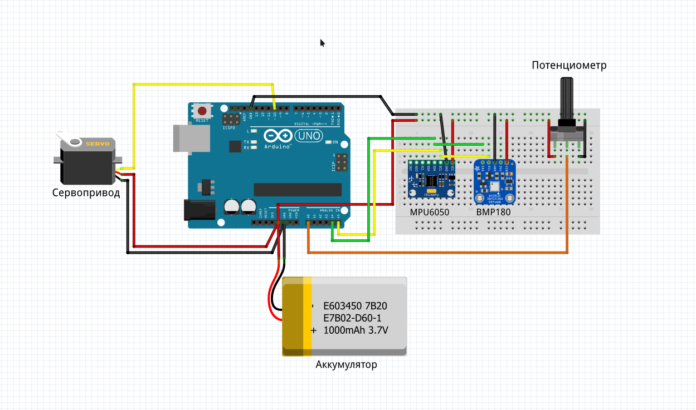

# Arduino-ROCKET

Что уже сделано сейчас:
1. макет десктопного приложения
2. запрограммировал получение данных с датчика bmp180
3. управление сервоприводом с помощью потенциометра

Планы на будущее:
1. установить коннект двух ардуино с помощью модуля NRF24L01
2. доделать управление рокетой с помощью приложения
3. вычислять скорость и ускорение ракеты с помощью датчика MPU6050

